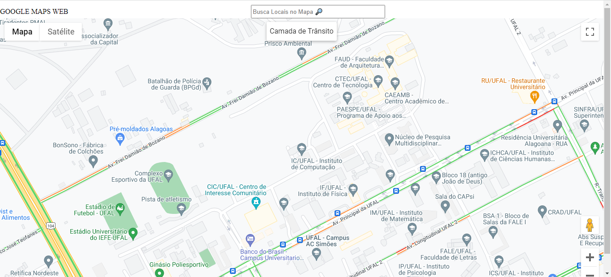

# Trafego_Urbano

Este documento descreve o código JavaScript que cria um mapa interativo com uma camada de tráfego ativável, um controle de camada e um componente de pesquisa de lugares. O código utiliza a biblioteca Google Maps JavaScript para renderizar o mapa e fornecer recursos de interatividade.

## Variáveis Globais
### map

Uma variável global que armazena a instância do mapa criada usando a biblioteca Google Maps JavaScript.

### IC

Um objeto que define as coordenadas da latitude (lat) e longitude (lng) para o centro inicial do mapa.

## Funções
### createCenterControl(map, trafficLayer, legendDiv)

Uma função que cria um controle no canto superior central do mapa para alternar a exibição da camada de tráfego. O controle também exibe uma legenda que indica o significado das cores na camada de tráfego.
#### Parâmetros:
map: A instância do mapa onde o controle será adicionado.

trafficLayer: A instância da camada de tráfego a ser controlada.

legendDiv: O elemento DIV onde a legenda da camada de tráfego será exibida.

### initMap()
A função principal que inicializa o mapa, configura a camada de tráfego, adiciona o controle de camada e o componente de pesquisa de lugares. Essa função é atribuída ao escopo global para ser acessível pela API do Google Maps.

## Fluxo de Execução
A função initMap é chamada quando a página é carregada. Ela cria uma instância do mapa com as coordenadas de IC como centro.

Uma instância da TrafficLayer (camada de tráfego) é criada e definida para ser exibida no mapa.

A função createCenterControl é chamada para criar um controle que permite alternar a exibição da camada de tráfego. O controle é adicionado ao canto superior central do mapa.

A função createCenterControl também adiciona uma legenda à camada de tráfego, indicando o significado das cores exibidas na camada.

Um componente de pesquisa de lugares é adicionado ao mapa, permitindo que os usuários pesquisem por lugares e vejam os resultados no mapa.

Quando um lugar é pesquisado, os marcadores anteriores são removidos e novos marcadores são adicionados ao mapa, indicando os lugares encontrados. O mapa é ajustado para exibir todos os marcadores.

## Observações
Certifique-se de incluir a biblioteca Google Maps JavaScript no seu HTML para que o código funcione corretamente.
O componente de pesquisa de lugares é ativado pela biblioteca Google Places.

# Executando o Código
Siga estas etapas para executar o código JavaScript e visualizar o mapa interativo:

## Configuração Inicial:
Certifique-se de que você tenha uma chave de API válida da Google Cloud Platform para usar a API do Google Maps JavaScript. Substitua YOUR_API_KEY no código HTML pela sua chave de API.

### OBS.: O codigo **map.html** já possuir uma chave ativa, que será desativada futuramente para impedir eventuais cobranças(Data de ativação: 18/08/2023).  

## Repositorio:
Baixe o repositorio git para seu computador, com os arquivos **map.html, map.css e map.js**.

## Visualização:
Abra o arquivo HTML em um navegador da web. Você deve ver um mapa interativo com um botão "Camada de Trânsito" no canto superior central. Ao clicar nesse botão, a camada de tráfego será ativada e desativada, e uma legenda de cores será exibida no canto superior esquerdo.

## Pesquisa de Lugares:
Use a caixa de pesquisa "Pesquisar lugares" para procurar lugares específicos. Os marcadores serão adicionados ao mapa para os lugares encontrados. O mapa será ajustado para mostrar todos os marcadores.
